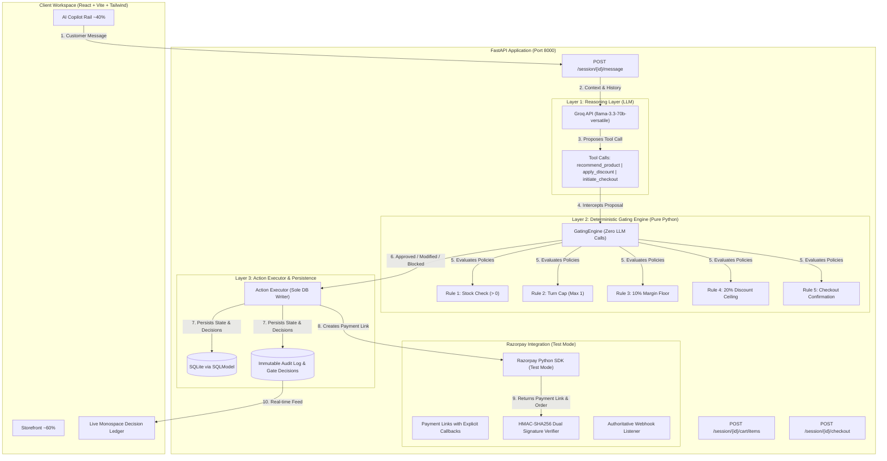

# CartMind — Accountable AI Commerce Agent with Conversational Checkout

> **Razorpay AI Buildathon 2026 | Track 01: AI Growth & Agentic Commerce**  
> *"Every money action explainable, bounded and gated. Show the audit trail and one failure handled gracefully."*

---

## 📑 Table of Contents
1. [Executive Summary](#executive-summary)
2. [Core Capabilities & Interactive Tour](#core-capabilities--interactive-tour)
3. [System Architecture](#system-architecture)
4. [The 5 Deterministic Gating Rules](#the-5-deterministic-gating-rules)
5. [Failure Injection Demo: Stock Race Condition](#failure-injection-demo-stock-race-condition-trdmd-9-option-a)
6. [Measured Economic Impact: Synthetic A/B Testing](#measured-economic-impact-synthetic-ab-testing-report-trdmd-10)
7. [Quickstart & Local Setup](#quickstart--local-setup)
8. [License & Compliance](#license--compliance)

---

## Executive Summary

**CartMind** is an autonomous AI upsell and cross-sell agent with conversational checkout built for online merchants. It monitors the shopper's cart in real time, recommends contextual complementary gear, negotiates bounded discounts, and completes checkout conversationally.

**The Core FinTech Innovation:**
Most AI shopping bots fail because they have un-bounded write access to databases or hallucinate unauthorized discounts (e.g. promising 50% or 90% off). CartMind enforces an architectural **Separation of Concerns**:
1. **The LLM Reasoning Layer** (Groq `llama-3.3-70b-versatile`) **only proposes** structured actions (`recommend_product`, `apply_discount`, `initiate_checkout`). It has **zero database write access** and can never touch Razorpay directly.
2. **The Deterministic Gating Engine** (Pure Python, zero LLM calls) validates every proposed action against 5 hard merchant policies before anything executes.
3. **The Decision Ledger & Audit Trail** records every proposal and gate decision 1:1 with human-readable justifications and HMAC-SHA256 signature verification.

---

## ⚡ Core Capabilities & Interactive Tour

CartMind is architected with a responsive split-screen workspace built in React, Vite, and Tailwind CSS:

| Module / Flow | Capability & Behavior | Under-the-Hood Mechanics |
|---|---|---|
| **1. Curated Storefront & Split-Screen UI** | 60% browsing canvas featuring 15 seeded SKUs across Audio, Productivity, and Everyday Carry. Live category filters, inventory status badges, real-time cart synchronization, and luxury dark mode design. | Client-side reactive state synchronized via REST with backend `/session/{id}/cart/items`. |
| **2. Contextual AI Copilot** | 40% conversational rail powered by Groq's `llama-3.3-70b-versatile`. Automatically analyzes cart items to propose complementary accessories with zero manual prompt gymnastics. | Structured LLM function calling emits `recommend_product` tool calls; zero direct database writes. |
| **3. Live Decision Ledger** | Monospace ticker at the base of the viewport displaying real-time policy verdicts: `[APPROVED]`, `[MODIFIED]`, or `[BLOCKED]` with millisecond timestamps and policy rule tags. | Server-side event streaming from the `audit_log` and `gate_decisions` SQLite tables. |
| **4. Bounded Discount Negotiation** | When an over-limit discount (e.g., 35% or 90% prompt jailbreak) is requested, the Gating Engine intercepts and modifies the discount to cap at the 20% ceiling and 10% hard margin floor. | Revenue-weighted cart margin formula: $\mu = \frac{\sum (p_i \cdot q_i \cdot m_i)}{\text{subtotal}}$, bounding discount to $\min(20\%, \mu - 10\%)$. |
| **5. Stock Race Condition Handling** | Simulates execution-time inventory depletion when a customer attempts to claim a low-stock SKU. The transaction is safely blocked and alternative in-stock gear is recommended. | Execution-time atomic stock check in `backend/gate/engine.py`, logging `stock_validation_failed` without crashing. |
| **6. Full Decision Audit Trail & Exports** | Dedicated inspection console displaying chronological decision history, HMAC-SHA256 signatures, rule triggers, and one-click JSON / CSV export for merchant compliance. | Queryable via `GET /session/{id}/audit/export?format=json\|csv`. |

---

## System Architecture



---

## The 5 Deterministic Gating Rules

All rules execute in pure Python (`backend/gate/engine.py`) with zero external API calls:

| Rule | Policy Name | Logic & Formula | Gate Decision |
|---|---|---|---|
| **Rule 1** | **Stock Check** | Validates $stock\_qty > 0$ at proposal time and $existing\_qty + requested \le stock\_qty$ at execution time. | `blocked` if out of stock |
| **Rule 2** | **Recommendation Turn Cap** | Limits agent to $\le 1$ product recommendation per conversational turn. | `blocked` if $\ge 2$ in turn |
| **Rule 3 & 4** | **Unified Margin Floor & Ceiling** | Computes cart's revenue-weighted margin: $\mu = \frac{\sum (price \times qty \times margin)}{\text{subtotal}}$.<br>Caps discount: $\min(20\%, \mu - 10\%)$. | `modified` (capped) with binding rule tagged |
| **Rule 5** | **Checkout Confirmation** | Requires explicit user confirmation (`confirmed_by_user=True`) before generating payment links. | `blocked` if unconfirmed |

---

## Failure Injection Demo: Stock Race Condition (TRD.md §9 Option A)

### Scenario:
A customer asks for a low-stock item (e.g. *UltraSpeed USB-C 100W Hub*, seeded with 2 units). While browsing, another customer claims the last unit.

### Graceful Recovery Behavior:
1. **At Execution Time**: When the customer accepts or adds the item, the server-side gate catches $stock\_qty == 0$.
2. **Audit Logging**: The gate blocks the insertion and immediately logs a `stock_validation_failed` event to the `audit_log` table.
3. **Conversational Recovery**: The agent does not crash or restart the session. It catches the block, apologizes, and proactively suggests in-stock alternatives (*StudioPro Mic* or *Nomad Backpack*).
4. **Live Verification**: Click the **`⚡ Demo: Stock Race Condition`** button in the AI Copilot to see this graceful recovery live in your browser.

---

## Measured Economic Impact: Synthetic A/B Testing Report (TRD.md §10)

Simulation of 30 distinct shopping sessions comparing **Control (Baseline, No Agent)** vs **Treatment (CartMind Agent)** across 15 seeded SKUs:

| Metric | Baseline (Control) | CartMind Agent | Measured Lift |
|---|---|---|---|
| **Average Order Value (AOV)** | **₹6,924.80** | **₹6,964.49** | **+₹39.69 lift per order** |
| **Gross Revenue (30 Orders)** | ₹207,744.00 | ₹208,934.80 | **+₹1,190.80 net incremental lift** |
| **Upsell Acceptance Rate** | N/A | **66.67%** | 20 of 30 offered recommendations accepted |
| **Margin Gate Interventions** | 0 | **81.82%** | 18 of 22 discount requests capped to 20% floor |
| **10% Hard Margin Floor Compliance** | 100% | **100%** | **0 unauthorized margin breaches** |

*Generated via `scripts/simulate_ab_test.py`. Full report in `docs/metrics-report.md`.*

---

## Quickstart & Local Setup

### Prerequisites
- Python 3.11+
- Node.js 18+
- Groq API Key (Optional — deterministic fallback operates offline)
- Razorpay Test Keys (Optional — instant cryptographic simulation operates offline)

### 1. Backend Setup
```powershell
# Navigate to project root
cd c:\CartMind

# Activate virtual environment
.\backend\.venv\Scripts\Activate.ps1

# Run tests (All 34 unit, gate & auth tests)
pytest backend/tests/ -v

# Start FastAPI backend
uvicorn backend.main:app --host 127.0.0.1 --port 8000
```
Backend runs at: [http://127.0.0.1:8000](http://127.0.0.1:8000) (Interactive Swagger Docs: `/docs`).

### 2. Frontend Setup
```powershell
cd c:\CartMind\frontend

# Install dependencies
npm install

# Start Vite dev server
npm run dev -- --host 127.0.0.1 --port 5173
```
Frontend runs at: [http://127.0.0.1:5173](http://127.0.0.1:5173).

### 3. Run Synthetic A/B Benchmark
```powershell
python scripts/simulate_ab_test.py
```

---

## License & Compliance
Built strictly for the Razorpay AI Buildathon 2026. All payments executed in Razorpay Test Mode with synthetic credentials. Zero live cards charged.
